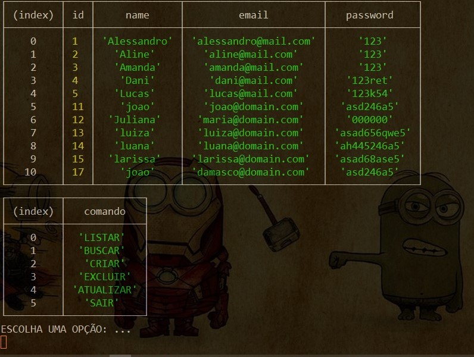

# Projeto mvc-terminal

Este projeto foi desenvolvido para explicar em live como funciona a comunicação de uma aplicação com banco de dados MySQL e CRUD na prática.

#### Tecnologias

- NodeJS
- ExpressJS
- Javascript
- MySQL
- Dotenv

###### Para executar este projeto siga os seguintes passos

`git clone https://github.com/ALESSANDROLMENEZES/MVC-SQL-LIVE.git`

`cd MVC-SQL-LIVE`

`npm install`

`npm run start`

###### Escolha uma das opções e interaja com o terminal de 0 a 5

**Divirta-se!** :smile:

